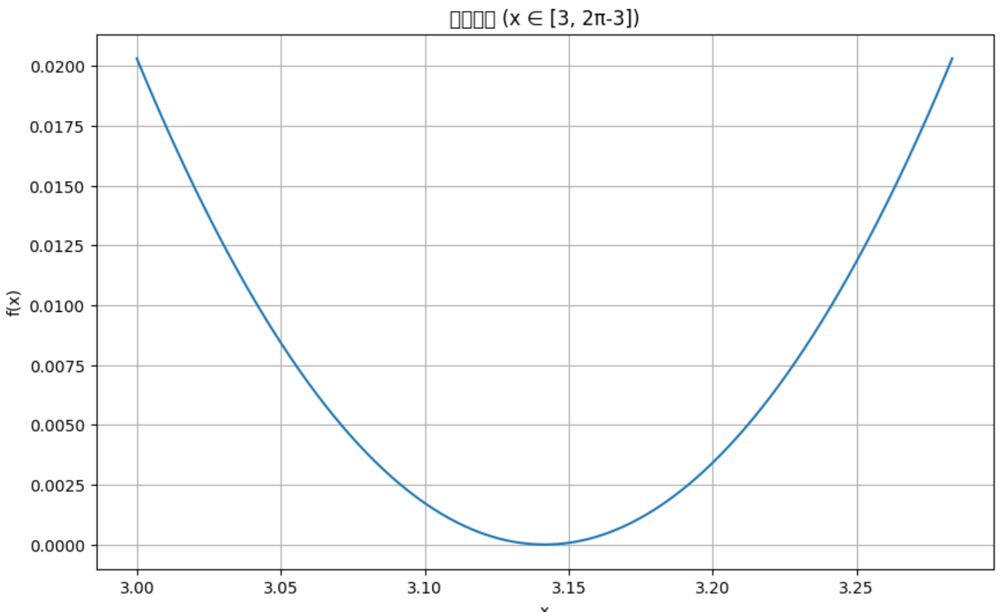
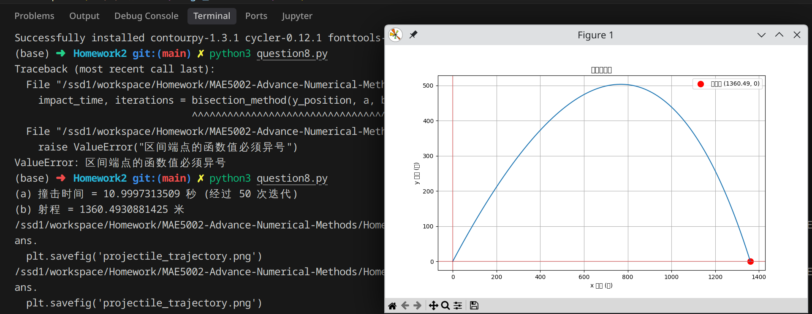

# Homework2
12432670 Zitong Huang

## Question 1
### Solution:
Consider $g'(x) = 6x-2$

Let $|g'(x)| < 1$, then $|6x-2| < 1$

we have the fixed point should located in $(\frac{1}{6}, \frac{1}{2})$, to use the fixed point iteration method.

Solve function $g(x) = x$: 

Let 
$$
h(x) = g(x) - x
$$

Let $h'(x) = 0$, we have $x = \frac{1}{2}$, so $h(x)$ has a local minimum at $x = \frac{1}{2}$.

Since 
$$
h(a) < 0, h(b) < 0, h(x_0) < 0
$$
where $(a, b)$ is the interval of $(\frac{1}{6}, \frac{1}{2})$, and $x_0$ is the local minimum.

we can have $h(x) < 0$ in $(\frac{1}{6}, \frac{1}{2})$.

So the function $g(x) = x$ have no solution in $(\frac{1}{6}, \frac{1}{2})$, which means the fixed point iteration method will not converge.

## Question 2
Apply the Mean Value Theorem to $g$ on the interval between $p_0$ and $p_1$. There exists $\xi$ between $p_0$ and $p_1$ such that:

$$g'( \xi ) = \frac{g(p_1) - g(p_0)}{p_1 - p_0}.$$

Given $p_2 = g(p_1)$ and $p_1 = g(p_0)$, we have:

$$g(p_1) - g(p_0) = p_2 - p_1,$$

so:

$$g'( \xi ) = \frac{p_2 - p_1}{p_1 - p_0}.$$

Since $|g'( \xi )| < K$:

$$\left| \frac{p_2 - p_1}{p_1 - p_0} \right| < K.$$

Then:

$$|p_2 - p_1| < K |p_1 - p_0|,$$

which is the desired inequality.

## Question 3
see question3.ipynb

the answer is 
we have 
$$
c_0 = 1.2701241482595913 \\
c_1 = 1.283232912796939 \\
c_2 = 1.2834259276134252 \\
c_3 = 1.283428701320108 \\
$$

## Question 4
see question4.ipynb

The answer is "*Cannot find answer*" for (a) and "*Can find answer*" for (b)

## Question 5

**Proof:**

Given $\frac{|b - a|}{2^{n+1}} < \delta$,

Take natural logarithms: $\ln\left(\frac{|b - a|}{\delta}\right) < \ln(2^{n+1})$,

Using logarithm properties: $\ln(|b - a|) - \ln(\delta) < (n+1) \ln(2)$,

Solve for $n+1$: $n + 1 > \frac{\ln(|b - a|) - \ln(\delta)}{\ln(2)}$,

Thus, $n > \frac{\ln(|b - a|) - \ln(\delta)}{\ln(2)} - 1$,

Since $N$ is the smallest integer number of iterations, $N = \left\lceil \frac{\ln(b - a) - \ln(\delta)}{\ln(2)} \right\rceil$,

Given the problem's form, $N = \text{int} \left( \frac{\ln(b - a) - \ln(\delta)}{\ln(2)} \right)$, which approximates the ceiling for practical iteration count.

**Q.E.D.**

## Question 6

see question6.ipynb
the answer is 0.7390851974487305

## Question 7

(a) formula $g(x) = x - sin(x) / cos(x) = x - tan(x)$

(b) No. $p_0 = 1$ will find root $x = 0$
Or, function $$\frac{|f(x) \cdot f''(x)|}{(f'(x))^2}$$
has value larger then 1 in the interval $(1, \pi + 1)$

(c) Yes. The function $$\frac{|f(x) \cdot f''(x)|}{(f'(x))^2}$$ is smaller than 1 in the interval $(3, 2 * \pi - 3)$

Here is the image:

## Question 8

see question8.py

the answer is

